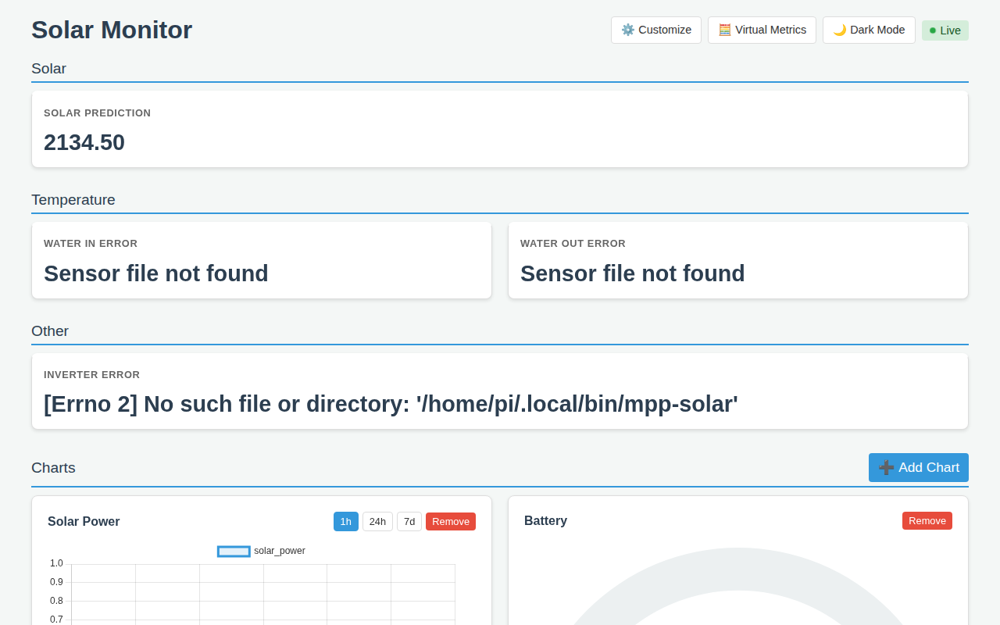
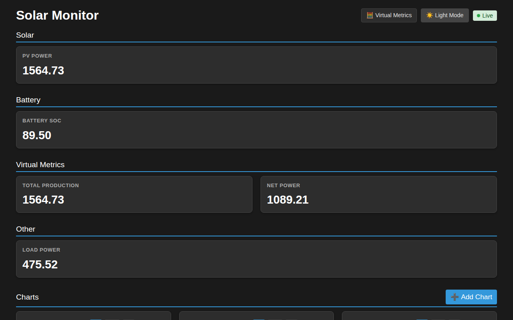

# ☀️ Pi Solar Monitor

[](https://www.python.org/)
[](https://fastapi.tiangolo.com/)
[](https://www.sqlite.org/)
[](https://www.raspberrypi.com/products/raspberry-pi-zero-2-w/)
[](https://www.chartjs.org/)


A lightweight, modular data collection and monitoring system designed for solar power setups. It is explicitly compatible with the **Raspberry Pi Zero 2 W**.

The system periodically polls various data sources via custom "collectors", stores the results in a local SQLite database, and provides a real-time web dashboard and API for data access.

## 📺 Visual Overview

### Demo
<video src="https://github.com/user-attachments/assets/7c12bd5d-e5e5-418a-a0c9-a53362b35552" autoplay loop muted playsinline controls width="100%">
</video>

### Dashboard
| Light Mode | Dark Mode |
| :---: | :---: |
|  |  |

## ✨ Features

- 🔌 **Modular Collection**: Run any executable script or binary (Python, Bash, etc.) to collect data.
- 🗄️ **Efficient Storage**: Local SQLite data retention with zero external dependencies.
- 📊 **Real-time Dashboard**: Built-in web interface with live updates via WebSockets and historical visualization using Chart.js.
- 🔌 **Robust API**: REST and WebSocket endpoints for easy access to live and historical data.
- 📲 **Automation Ready**: Integrated Macrodroid webhook support to trigger mobile notifications or logic.
- 🪶 **Ultra Lightweight**: Specifically optimized for low-power hardware like the Pi Zero 2 W.

## 🚀 High-Performance for Low-Power Hardware

The Pi Solar Monitor is engineered for efficiency on the Raspberry Pi Zero 2 W:
- **Optimized SQLite**: Uses Write-Ahead Logging (WAL) and `PRAGMA synchronous=NORMAL` for minimal disk I/O latency.
- **Asynchronous I/O**: Database writes are offloaded to separate threads, keeping the main event loop responsive.
- **Compact API**: Specialized endpoints provide slim JSON payloads (up to 90% reduction) for fast chart rendering on mobile devices.
- **Visual Cues**: Subtle CSS pulsing animations provide real-time connection status without heavy CPU overhead.

## ⏱️ Quick Start

### Installation

```bash
# Clone the repository
git clone <repository-url>
cd pi-solar-monitor

# Install dependencies
pip install -r requirements.txt

# Initialize the database
python3 init_db.py
```

### Running

To start the collection engine and web server:
```bash
python3 main.py
```
The dashboard will be available at `http://<your-pi-ip>:8000`.

---

## 📚 Documentation

Detailed documentation for installation, customization, and advanced usage is available in the `docs/` directory:

- [**Hardware Setup**](docs/installation.md#hardware-setup) - Enabling 1-Wire and connecting sensors/inverters.
- [**Installation Guide**](docs/installation.md) - Full setup instructions and systemd service configuration.
- [**Usage Guide**](docs/usage.md) - Dashboard customization and Macrodroid integration.
- [**Data Collectors**](docs/collectors.md) - How to write and schedule your own sensors.
- [**REST API**](docs/api.md) - Endpoint documentation and query parameters.
- [**WebSockets**](docs/websockets.md) - Real-time data streaming specifications.

---
*Note: This project stores all historical data indefinitely in `data/inverter_logs.db`. Ensure your SD card has sufficient space for long-term use.*
- **Lightweight**: Optimized for low-power hardware like the Pi Zero 2 W.
  

## Demo
<video src="https://github.com/user-attachments/assets/7c12bd5d-e5e5-418a-a0c9-a53362b35552" autoplay loop muted playsinline controls width="100%">
</video>


## Hardware Setup

### Enabling 1-Wire (Required for temperature sensors)

If you are using DS18B20 temperature sensors (as used in the default `temps.py` collector), you must enable the 1-Wire interface on your Raspberry Pi.

1. Run `sudo raspi-config`.
2. Navigate to **Interface Options** -> **1-Wire** and select **Yes**.
3. Reboot your Pi: `sudo reboot`.

Alternatively, add `dtoverlay=w1-gpio` to your `/boot/config.txt` and reboot.

## Installation

1. **Clone the repository:**
   ```bash
   git clone <repository-url>
   cd pi-solar-monitor
   ```

2. **Install dependencies:**
   ```bash
   pip install -r requirements.txt
   ```

3. **Initialize the database:**
   ```bash
   python3 init_db.py
   ```

## Usage

### Manual Execution

To start the collection engine and the web server manually:

```bash
python3 main.py
```

The dashboard will be available at `http://<your-pi-ip>:8000`.

### Running as a Systemd Service

To ensure the monitor starts automatically on boot, create a systemd service file.

1. Create a new service file:
   ```bash
   sudo nano /etc/systemd/system/pi-solar.service
   ```

2. Paste the following configuration (adjust `User`, `WorkingDirectory`, and path to `python3` if necessary. Note: replace `pi` with your actual username if different):
   ```ini
   [Unit]
   Description=Pi Solar Monitor Service
   After=network.target

   [Service]
   User=pi
   WorkingDirectory=/home/pi/pi-solar-monitor
   ExecStart=/usr/bin/python3 main.py
   Restart=always
   RestartSec=10

   [Install]
   WantedBy=multi-user.target
   ```

3. Reload systemd, enable and start the service:
   ```bash
   sudo systemctl daemon-reload
   sudo systemctl enable pi-solar.service
   sudo systemctl start pi-solar.service
   ```

## Custom Collectors

The engine executes any file in the `collectors/` directory (and its scheduled subdirectories) that has execution permissions. (__Ensure script files, like python, have their relevant shebang line at the top of the file.__)
Each collector should output a valid JSON object to `stdout`. The engine aggregates these objects into a single record.

### Scheduling

You can schedule collectors by placing them in specific subdirectories within the `collectors/` folder:

- **`collectors/`**: Scripts in the root run every minute (55s timeout).
- **`collectors/minutely/`**: Scripts run every minute (55s timeout).
- **`collectors/hourly/`**: Scripts run at the top of every hour (300s timeout).
- **`collectors/daily/`**: Scripts run at midnight (00:00) every day (300s timeout).

### Implementing a Custom Collector

A collector can be written in any language (Python, Bash, C, etc.).

#### Example: Analog Voltage Sensor (via ADC)

Here is an example of a Python collector that reads a voltage from an ADS1115 ADC:

```python
#!/usr/bin/env python3
import json
import sys

# Example using a library like Adafruit_ADS1x15
# (Ensure you install necessary libraries first)
try:
    # This is a mock example of reading an ADC
    # In a real scenario, you'd use: import Adafruit_ADS1x15

    voltage_reading = 12.65  # Replace with actual sensor reading logic

    data = {
        "battery_voltage": voltage_reading
    }

    print(json.dumps(data))
except Exception as e:
    # It's best to output nothing or handle errors silently to avoid
    # corrupting the aggregated JSON if the engine doesn't catch it.
    sys.exit(1)
```

**Steps to implement:**
1. Save the script in the `collectors/` directory (e.g., `collectors/voltage.py`).
2. Make it executable: `chmod +x collectors/voltage.py`.

## API Documentation

The system provides a FastAPI-based web server.

### REST API

- **GET `/api/last`**: Returns the most recent data point (full JSON).
- **GET `/api/history?limit=100`**: Returns the last `N` data points. Optional query parameters `start` and `end` (ISO timestamps) can be used to filter results.
- **GET `/api/keys`**: Returns a list of all available data keys found in recent records.
- **GET `/api/data/{key}/last`**: Returns the most recent value for a specific key.
- **GET `/api/data/{key}/history`**: Returns historical values for a key in a compact format: `[[timestamp, value], ...]`.
- **GET `/api/data/{key}/stats`**: Returns aggregate statistics (`avg`, `min`, `max`, `sum`, `count`) for a key.

#### Advanced Query Parameters

For `/api/data/{key}/history` and `/api/data/{key}/stats`:

- **Time Filtering**:
    - `start`, `end`: Can be an ISO timestamp (`2023-10-27 10:00:00`) or a relative time string:
        - `today`: Since 00:00 of the current day.
        - `10s`, `5m`, `1h`, `7d`: Last X seconds, minutes, hours, or days.
- **Value Filtering**:
    - `gt`: Greater than.
    - `lt`: Less than.
    - `eq`: Equal to.
- **Limit**:
    - `limit`: (For history only) Max number of records to return (default 100).

### WebSocket API

- **WS `/ws`**: Broadcasts new data points as they are collected.
  - Message format: `{"type": "new_data", "payload": {"timestamp": "...", "data": {...}}}`

## Dashboard

The dashboard is served at the root URL (`/`). It provides:
- **Live Metrics**: Automatically displays all top-level keys from the collected JSON as cards.
- **Historical Chart**: Visualizes numeric trends over the last hour using Chart.js.

## Macrodroid Integration

Every time data is collected, it is sent via an HTTP POST request to a Macrodroid webhook. This allows you to create automations on your Android device based on your solar data.

The integration is configured in `engine.py`. To use it, replace the `MACRODROID_URL` with your specific device's trigger URL.

---
*Note: This project stores all historical data indefinitely in `data/inverter_logs.db`. Ensure your SD card has sufficient space for long-term use.*
