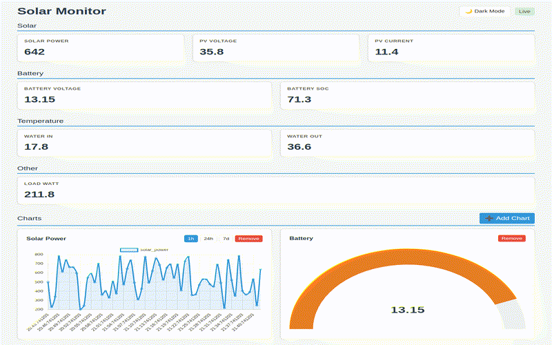

# pi solar monitor

A lightweight, modular data collection and monitoring system designed for solar power setups. It is explicitly compatible with the **Raspberry Pi Zero 2 W**.

The system periodically polls various data sources via custom "collectors", stores the results in a local SQLite database, and provides a real-time web dashboard and API for data access.

## Features

- **Modular Collection**: Run any executable script or binary to collect data.
- **SQLite Storage**: Efficient local data retention.
- **Real-time Dashboard**: Built-in web interface with live updates via WebSockets and historical visualization using Chart.js.
- **REST API**: Easy access to the latest data and historical logs.
- **Macrodroid Integration**: Automatically trigger Macrodroid webhooks with collected data for automation.
- **Lightweight**: Optimized for low-power hardware like the Pi Zero 2 W.



## Hardware Setup

### Enabling 1-Wire (Required for temperature sensors)

If you are using DS18B20 temperature sensors (as used in the default `temps.py` collector), you must enable the 1-Wire interface on your Raspberry Pi.

1. Run `sudo raspi-config`.
2. Navigate to **Interface Options** -> **1-Wire** and select **Yes**.
3. Reboot your Pi: `sudo reboot`.

Alternatively, add `dtoverlay=w1-gpio` to your `/boot/config.txt` and reboot.

## Installation

1. **Clone the repository:**
   ```bash
   git clone <repository-url>
   cd pi-solar-monitor
   ```

2. **Install dependencies:**
   ```bash
   pip install -r requirements.txt
   ```

3. **Initialize the database:**
   ```bash
   python3 init_db.py
   ```

## Usage

### Manual Execution

To start the collection engine and the web server manually:

```bash
python3 main.py
```

The dashboard will be available at `http://<your-pi-ip>:8000`.

### Running as a Systemd Service

To ensure the monitor starts automatically on boot, create a systemd service file.

1. Create a new service file:
   ```bash
   sudo nano /etc/systemd/system/pi-solar.service
   ```

2. Paste the following configuration (adjust `User`, `WorkingDirectory`, and path to `python3` if necessary. Note: replace `pi` with your actual username if different):
   ```ini
   [Unit]
   Description=Pi Solar Monitor Service
   After=network.target

   [Service]
   User=pi
   WorkingDirectory=/home/pi/pi-solar-monitor
   ExecStart=/usr/bin/python3 main.py
   Restart=always
   RestartSec=10

   [Install]
   WantedBy=multi-user.target
   ```

3. Reload systemd, enable and start the service:
   ```bash
   sudo systemctl daemon-reload
   sudo systemctl enable pi-solar.service
   sudo systemctl start pi-solar.service
   ```

## Custom Collectors

The engine executes any file in the `collectors/` directory that has execution permissions. Each collector should output a valid JSON object to `stdout`. The engine aggregates these objects into a single record every minute.

### Implementing a Custom Collector

A collector can be written in any language (Python, Bash, C, etc.).

#### Example: Analog Voltage Sensor (via ADC)

Here is an example of a Python collector that reads a voltage from an ADS1115 ADC:

```python
#!/usr/bin/env python3
import json
import sys

# Example using a library like Adafruit_ADS1x15
# (Ensure you install necessary libraries first)
try:
    # This is a mock example of reading an ADC
    # In a real scenario, you'd use: import Adafruit_ADS1x15

    voltage_reading = 12.65  # Replace with actual sensor reading logic

    data = {
        "battery_voltage": voltage_reading
    }

    print(json.dumps(data))
except Exception as e:
    # It's best to output nothing or handle errors silently to avoid
    # corrupting the aggregated JSON if the engine doesn't catch it.
    sys.exit(1)
```

**Steps to implement:**
1. Save the script in the `collectors/` directory (e.g., `collectors/voltage.py`).
2. Make it executable: `chmod +x collectors/voltage.py`.

## API Documentation

The system provides a FastAPI-based web server.

### REST API

- **GET `/api/last`**: Returns the most recent data point (full JSON).
- **GET `/api/history?limit=100`**: Returns the last `N` data points. Optional query parameters `start` and `end` (ISO timestamps) can be used to filter results.
- **GET `/api/keys`**: Returns a list of all available data keys found in recent records.
- **GET `/api/data/{key}/last`**: Returns the most recent value for a specific key.
- **GET `/api/data/{key}/history`**: Returns historical values for a key in a compact format: `[[timestamp, value], ...]`.
- **GET `/api/data/{key}/stats`**: Returns aggregate statistics (`avg`, `min`, `max`, `sum`, `count`) for a key.

#### Advanced Query Parameters

For `/api/data/{key}/history` and `/api/data/{key}/stats`:

- **Time Filtering**:
    - `start`, `end`: Can be an ISO timestamp (`2023-10-27 10:00:00`) or a relative time string:
        - `today`: Since 00:00 of the current day.
        - `10s`, `5m`, `1h`, `7d`: Last X seconds, minutes, hours, or days.
- **Value Filtering**:
    - `gt`: Greater than.
    - `lt`: Less than.
    - `eq`: Equal to.
- **Limit**:
    - `limit`: (For history only) Max number of records to return (default 100).

### WebSocket API

- **WS `/ws`**: Broadcasts new data points as they are collected.
  - Message format: `{"type": "new_data", "payload": {"timestamp": "...", "data": {...}}}`

## Dashboard

The dashboard is served at the root URL (`/`). It provides:
- **Live Metrics**: Automatically displays all top-level keys from the collected JSON as cards.
- **Historical Chart**: Visualizes numeric trends over the last hour using Chart.js.

## Macrodroid Integration

Every time data is collected, it is sent via an HTTP POST request to a Macrodroid webhook. This allows you to create automations on your Android device based on your solar data.

The integration is configured in `engine.py`. To use it, replace the `MACRODROID_URL` with your specific device's trigger URL.

---
*Note: This project stores all historical data indefinitely in `data/inverter_logs.db`. Ensure your SD card has sufficient space for long-term use.*
