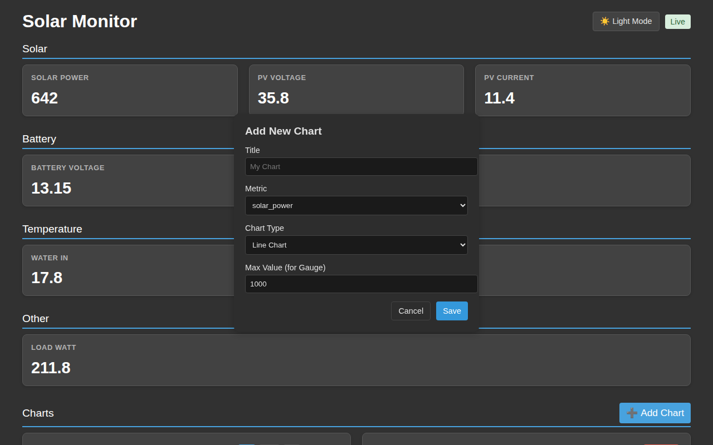
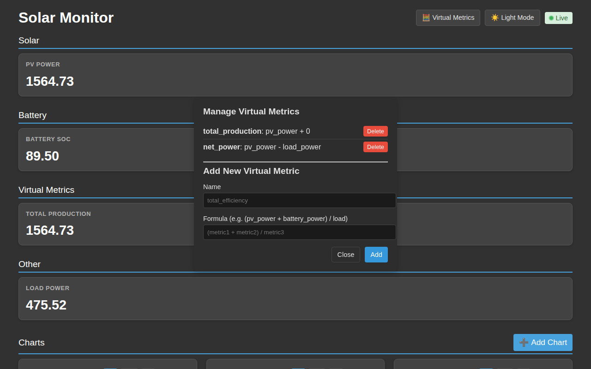

# 🖥️ Usage Guide

The **Pi Solar Monitor** provides a real-time web dashboard and automation integrations to monitor and manage your solar power system.

---

## 📊 Web Dashboard

Access the dashboard at `http://<your-pi-ip>:8000`.

### Real-time Metrics

The dashboard automatically categorizes and displays metrics collected by the system.
- **Solar ☀️**: PV voltage, power, and yield.
- **Battery 🔋**: Voltage, charge/discharge current, and state of charge (SOC).
- **Temperature 🌡️**: Readings from your DS18B20 sensors.


---

## ✨ Dashboard Customization

### 🎨 Themes
Toggle between **Light** and **Dark** modes using the toggle in the header. Your preference is saved in your browser's local storage.


### 📈 Adding Charts
You can add custom charts to visualize any numeric metric.
1. Click the **+ Add Chart** button.
2. Select the **Metric** to visualize.
3. Choose the **Chart Type**:
    - **Line Chart**: Shows historical trends over time (1h, 24h, 7d).
    - **Gauge**: Shows the latest value on a semi-circular scale.
4. Set a **Max Value** for Gauge charts.



### 🛠️ Managing Charts
- **Time Range**: On line charts, use the 1h, 24h, or 7d buttons to change the scale.
- **Removing**: Click the **Remove** button on any chart card to delete it from your dashboard.

---

## 🧮 Virtual Metrics

Virtual metrics allow you to create new data points by performing calculations on existing ones. They are calculated on the server and are available for charts and the API just like physical metrics.

### ✨ How to Create

1. Click the **🧮 Virtual Metrics** button in the header.
2. Enter a **Name** for your new metric (e.g., `solar_efficiency`).
3. Enter a **Formula** (e.g., `pv_power / load_power`).
4. Click **Add**.



### 🛡️ Security and Efficiency
Virtual metrics are evaluated safely using Python's `ast` module, preventing arbitrary code execution. For historical queries, formulas are converted to optimized SQLite expressions and cached for maximum performance on the Raspberry Pi Zero 2 W.

---

## 📲 Automation (Macrodroid)

The system can trigger Macrodroid webhooks on every data collection cycle (every minute), allowing for mobile notifications and complex logic.

### ⚙️ Configuration

1. Open `engine.py`.
2. Locate the `MACRODROID_URL` constant.
3. Replace the placeholder URL with your device's unique Macrodroid webhook URL.

```python
MACRODROID_URL = "https://trigger.macrodroid.com/YOUR_DEVICE_UUID/solar_data"
```

> [!TIP]
> **Best Practices for Automation**:
> - Use the **battery_voltage** to trigger alerts when it drops below a threshold.
> - Monitor **solar_prediction** to decide when to run heavy loads.
> - Send a "Critical" notification if **inverter_error** is not empty.

### 📦 Data Payload

The entire collected data object is sent as a JSON payload in a POST request. You can use Macrodroid's "Webhook" trigger and parse the JSON variables to create custom automations (e.g., "Notify me if battery is below 48V").

---

## 📈 External Data Access

The system provides a unified **External Charts API** designed for easy integration with third-party tools like Home Assistant, custom widgets, or other monitoring systems.

### 🔗 Quick Access
Use the `/api/chart/data` endpoint to retrieve data for any metric by specifying its type (gauge/line) and a time period.

**Examples:**
- **Latest Battery Voltage (Gauge)**: `GET /api/chart/data?type=gauge&metric=battery_voltage`
- **Solar Power (24h Trend)**: `GET /api/chart/data?type=line&metric=solar_power&period=24h`

For full details, see the [REST API Documentation](api.md#external-charts-api).

---

## 📝 Logging System

The system includes an optional logging system for monitoring collection and automation activities. Logs are stored in `/var/log/pi-solar.log`.

### ⚙️ Enabling Logging

Logging can be enabled via the command line when starting the system:

```bash
# Run with standard logging (INFO level)
python3 main.py --log-level STANDARD

# Run with detailed debug logging
python3 main.py --log-level DEBUG
```

Alternatively, you can set the default `log_level` variable at the top of `main.py`.

### 🔍 Log Levels

| Level | Description |
| :--- | :--- |
| `OFF` | (Default) No logging to file. |
| `STANDARD` | Logs collector execution/skips, condition triggers (with details), and raw data for **hourly/daily** collectors. |
| `DEBUG` | Most verbose. Includes everything in STANDARD plus raw data for **minutely** collectors and detailed reasons for skipped conditions. |

### 📋 Log Format
The logs follow a standard format:
`YYYY-MM-DD HH:MM:SS - LEVEL - MODULE - MESSAGE`

Example:
`2023-10-27 10:00:00,123 - INFO - engine - Running collector: collectors/hourly/solar_predict.py`
